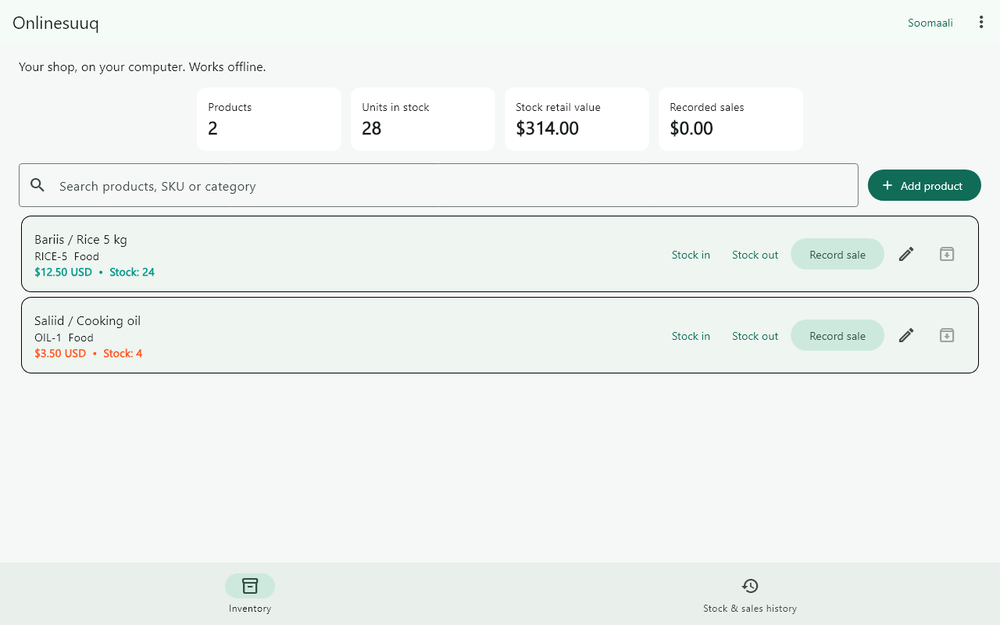

# Onlinesuuq

**Dukaankaaga, gacantaada. — Your shop, in your hands.**

## Windows: offline inventory

Manage products, stock and sales on your own PC, without an account or backend. Somali and English are included.

[Download Windows Setup.exe](https://github.com/Mohamed-Qadar/Onlinesuuq/releases/latest/download/Onlinesuuq-Setup.exe) · [Release notes](https://github.com/Mohamed-Qadar/Onlinesuuq/releases/latest)

Run **Onlinesuuq-Setup.exe**, click Install, and open Onlinesuuq from the Start menu. Windows 10/11 x64. The installer includes the required runtime; users do not need Python, Flutter or a database server.

- Add products, SKU, category, USD price and opening stock.
- Record stock in/out and sales, search products and review history.
- Use **Export backup** regularly, preferably to another drive. **Restore backup** replaces the inventory with a selected backup after confirmation.
- Data stays in this Windows user's application-data folder, outside the installation directory. Updates and uninstall retain it. See **About / data location** for the exact location.
- No online ordering, payments or automatic cloud synchronization in the offline release. Recorded sales are local bookkeeping entries, not payment confirmations.

**Soomaali:** Soo dejiso faylka rakibidda, ku dar alaabtaada, maamul kaydka oo diiwaangeli iibka. Internet iyo akoon looma baahna. Samee nuqul joogto ah.

[Step-by-step English / Somali guide](docs/OFFLINE_GUIDE.md)

## Build

`packaging/windows/Build-Setup.ps1 -Mode offline` runs Flutter analysis/tests, builds `lib/offline_main.dart`, bundles the runtime and creates `dist/Onlinesuuq-Setup.exe` plus SHA256 checksum. Requires Flutter 3.47.6, Visual Studio C++ tools and Inno Setup 6.3+.

GitHub **Actions → Build Windows Setup → Run workflow → offline** does the build on Windows, checks installation/native startup/uninstall and creates a draft release. Review checks before publishing. The installer is currently unsigned.

## Future online version

The original Flutter storefront entry point (`lib/main.dart`) and Django/PostgreSQL backend remain in the repository. Build with `-Mode online -ApiUrl https://YOUR_REAL_HOST/api/v1/` only after deploying a live backend. Local stock is not automatically synced; the versioned JSON export preserves identifiers and history for a future explicit migration.

[Windows instructions](docs/WINDOWS_RELEASE.md) · [Local development (Turkish)](docs/LOCAL_DEVELOPMENT_TR.md) · [API](docs/API.md) · [Offline release notes](docs/release-offline.md)

Never commit `.env`, private keys, tokens, backups or customer data.
